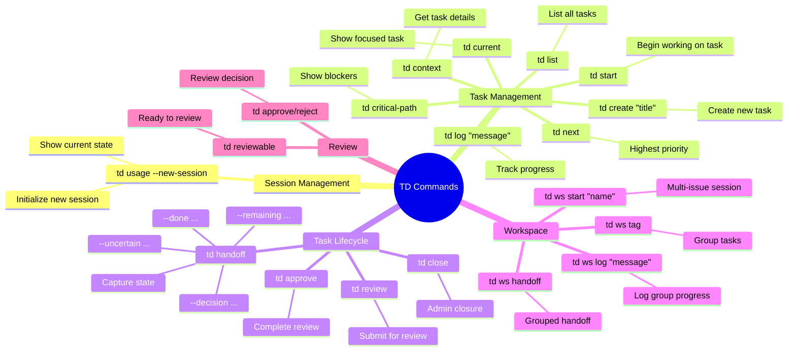
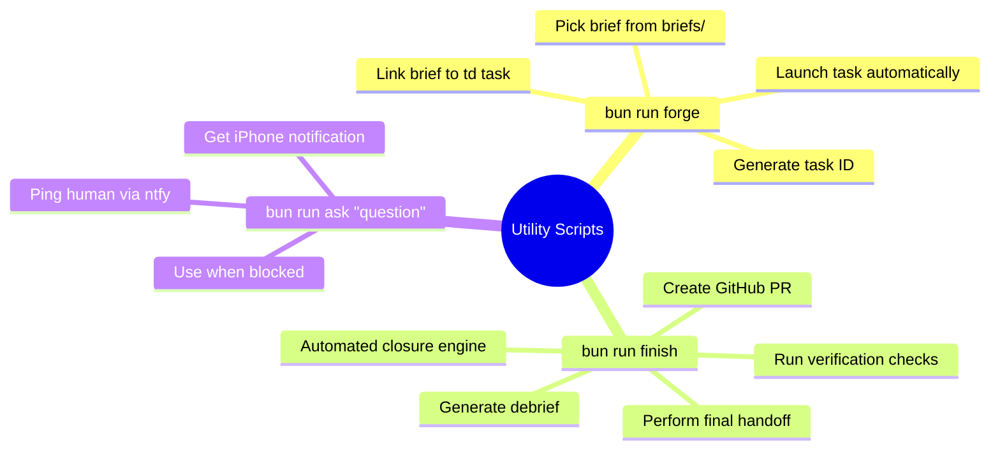
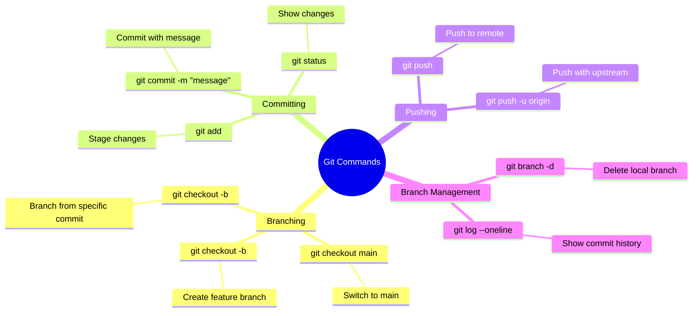
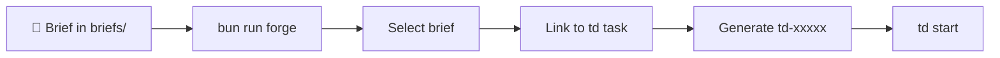
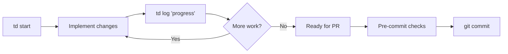
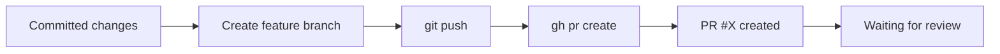
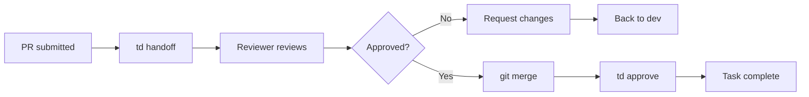
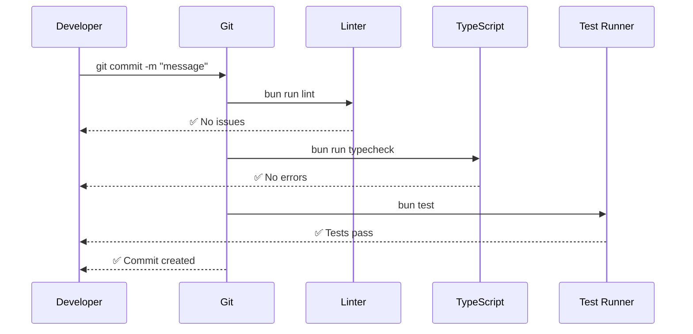
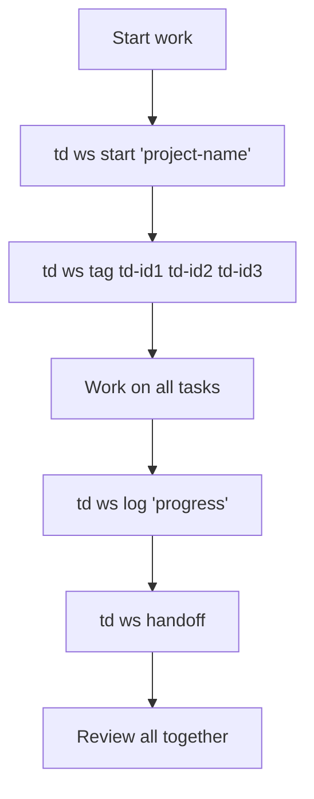

flowchart TD
    Start([Start Work]) --> InitSession
    
    subgraph Session["🧠 Session Initialization"]
        InitSession["td usage --new-session"]
        InitSession -->|creates session ID| ShowState["Show current work territory<br/>FOCUSED ISSUE<br/>WORKFLOW INSTRUCTIONS"]
    end
    
    InitSession --> Decision{Brief Available?}
    
    Decision -->|Yes| Forge["bun run forge<br/>Pick brief from briefs/"]
    Decision -->|No| CreateTask["td create 'title'<br/>--description 'desc'"]
    
    subgraph BriefForge["🔨 Brief Forge Lifecycle"]
        Forge --> LinkBrief["Link brief to td task<br/>GENERATES TASK ID: td-xxxxx"]
        LinkBrief --> StartWork["td start <id>"]
    end
    
    CreateTask --> StartWork
    
    subgraph Development["💻 Development Phase"]
        StartWork --> ShowCurrent["td current<br/>Show working task"]
        ShowCurrent --> DevLoop["Development Loop"]
        
        DevLoop --> Implement["Implement changes<br/>Write code, tests, docs"]
        
        Implement --> LogProgress["td log 'progress message'<br/>Track work completed"]
        
        LogProgress --> Blocked{Blocked?}
        
        Blocked -->|Yes| UseAsk["bun run ask 'question'<br/>Ping human via ntfy"]
        Blocked -->|No| CheckCommands["Review TD commands"]
        
        UseAsk --> CheckCommands
        
        subgraph TDCommands["📋 Available TD Commands"]
            CheckCommands --> ListTasks["td list<br/>List all tasks"]
            CheckCommands --> GetContext["td context <id><br/>Full task context"]
            CheckCommands --> CriticalPath["td critical-path<br/>What unblocks most work"]
            CheckCommands --> NextTask["td next<br/>Highest priority task"]
        end
        
        ListTasks --> DevLoop
        GetContext --> DevLoop
        CriticalPath --> DevLoop
        NextTask --> DevLoop
    end
    
    DevLoop --> Ready{Ready for Review?}
    
    Ready -->|No| DevLoop
    Ready -->|Yes| PrepareGit["Git Preparation"]
    
    subgraph GitWorkflow["🔀 Git & PR Workflow"]
        PrepareGit --> Branch["Checkout feature branch<br/>git checkout -b feature-name"]
        Branch --> Commit["Commit changes<br/>git commit -m 'message'"]
        Commit -->|runs pre-commit| PreCommit["Pre-commit checks<br/>bun run lint && typecheck"]
        PreCommit --> Push["Push to remote<br/>git push -u origin feature"]
        Push --> CreatePR["Create PR<br/>gh pr create"]
    end
    
    CreatePR --> PRReview["📋 PR Created<br/>Waiting for review"]
    
    subgraph TaskLifecycle["📝 Task Lifecycle"]
        PRReview --> Handoff["td handoff <id><br/>--done ...<br/>--remaining ...<br/>--decision ...<br/>--uncertain ..."]
        
        Handoff -->|Different session| SubmitReview["td review <id><br/>Submit for review"]
        SubmitReview --> ReviewerAction["Reviewer reviews"]
        
        ReviewerAction --> Approved{Approved?}
        
        Approved -->|Yes| MergePR["Merge PR into main"]
        Approved -->|No| RequestChanges["Request changes"]
        
        RequestChanges --> DevLoop
        MergePR --> CompleteTask["td approve <id><br/>Complete task"]
    end
    
    CompleteTask --> Success([✅ Task Complete])
    
    subgraph WorkSession["💼 Multi-Issue Workspace"]
        StartWork -->|multiple related| Workspace["td ws start 'name'"]
        Workspace --> TagTasks["td ws tag <ids>"]
        TagTasks --> WSLog["td ws log 'message'"]
        WSLog --> WSHandoff["td ws handoff<br/>Grouped handoff"]
    end
    
    WSHandoff --> Success
    
    subgraph AdminActions["🔧 Admin Actions"]
        StartWork -->|admin closure| CloseTask["td close <id><br/>For: duplicates, won't-fix"]
        ShowCurrent --> Reviewable["td reviewable<br/>Issues ready for review"]
        Reviewable --> ApproveReject["td approve/reject <id><br/>Complete review"]
    end
    
    CloseTask --> End([End])
    ApproveReject --> Success
    
    style InitSession fill:#e1f5e1
    style Forge fill:#f39c12
    style CreateTask fill:#f39c12
    style StartWork fill:#e1f5e1
    style DevLoop fill:#d1fae5
    style Handoff fill:#ffd700
    style CreatePR fill:#4caf50
    style MergePR fill:#4caf50
    style CompleteTask fill:#4caf50
    style Success fill:#4caf50
    style UseAsk fill:#ff9800
```

## Command Reference

### TD Core Commands



### Utility Scripts



### Git Commands Used



## Session Boundaries

### Start of Session
```bash
td usage --new-session  # REQUIRED at conversation start or after /clear
```

**Purpose:** Initialize session ID and show current work territory map

### End of Session
```bash
td handoff <id> --done ... --remaining ... --decision ... --uncertain ...
```

**Purpose:** Capture state before stopping work

## Workflow Phases

### Phase 1: Brief to Task


### Phase 2: Development


### Phase 3: PR Creation


### Phase 4: Review & Merge


## Important Notes

### Session Rules
- **Start:** `td usage --new-session` at conversation start
- **End:** `td handoff <id>` before stopping work
- **Multi-issue:** Use `td ws` commands to group handoffs
- **Review:** Cannot approve issues you implemented (exception: minor tasks)

### Pre-commit Flow


### Handoff Structure
```bash
td handoff <id> \
  --done "What was completed" \
  --remaining "What's left to do" \
  --decision "Key decisions made" \
  --uncertain "Uncertain items"
```

## Multi-Issue Workflow

When working on multiple related issues:



## Related Documentation

- **AGENTS.md** - Task management lifecycle and rules
- **playbooks/cli-design-playbook.md** - CLI design patterns
- **debriefs/** - Archived briefs and learning
- **Taskfile.yml** - Project-specific task definitions

## Workflow Summary

1. **Initialize:** `td usage --new-session` (mandatory grounding signal)
2. **Forge:** `bun run forge` picks brief, creates task
3. **Develop:** Implement, `td log`, iterate, use `bun run ask` if blocked
4. **Git:** Commit, push, create PR
5. **Handoff:** `td handoff <id>` captures state
6. **Review:** Different session reviews, approves
7. **Complete:** `td approve <id>` finishes task

**Key Principle:** Each session tracks implementer. You cannot approve your own work. Different session handles review/approval.