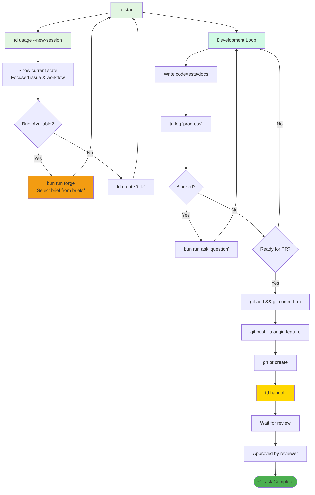
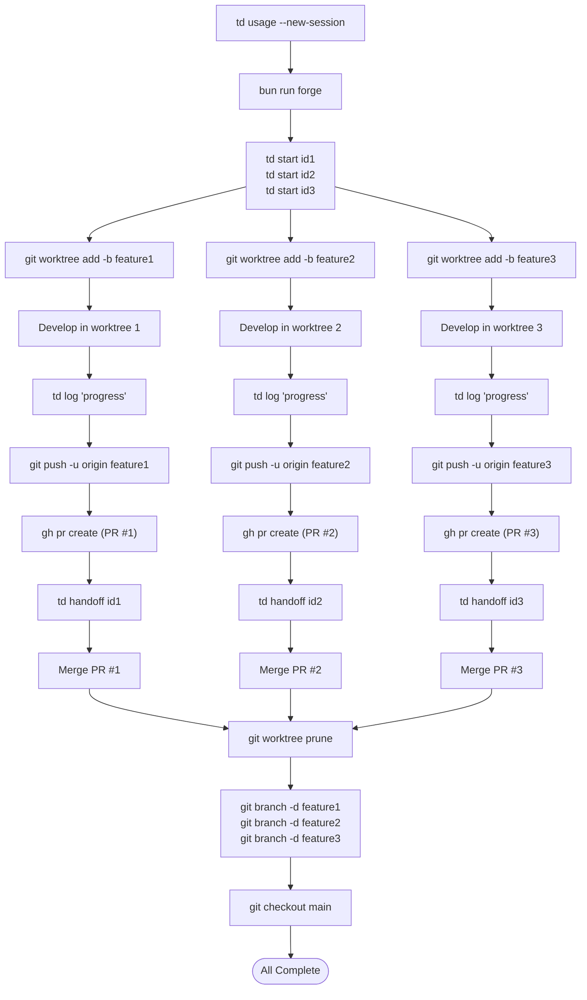
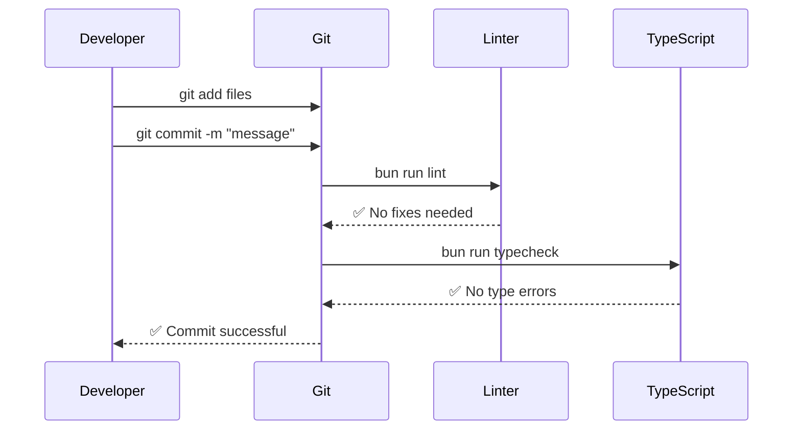
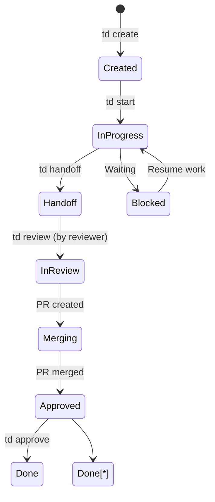

# Test Mermaid Charts

This file contains mermaid diagrams for testing actual project workflows.

## TD Workflow (Session to Task Complete)

Shows the complete workflow from session initialization through task completion.


```mermaid
flowchart TD
    Start([Start Work]) --> Init["td usage --new-session"]
    Init --> Show["Show current state<br/>Focused issue & workflow"]
    
    Show --> Brief{Brief Available?}
    Brief -->|Yes| Forge["bun run forge<br/>Select brief from briefs/"]
    Brief -->|No| Create["td create 'title'"]
    
    Forge --> Start["td start <id>"]
    Create --> Start
    
    Start --> DevLoop[Development Loop]
    
    DevLoop --> Work["Write code/tests/docs"]
    Work --> Log["td log 'progress'"]
    Log --> Blocked{Blocked?}
    
    Blocked -->|Yes| Ask["bun run ask 'question'"]
    Blocked -->|No| Ready{Ready for PR?}
    
    Ask --> DevLoop
    Ready -->|No| DevLoop
    Ready -->|Yes| Commit["git add && git commit -m"]
    
    Commit --> Push["git push -u origin feature"]
    Push --> PR["gh pr create"]
    PR --> Handoff["td handoff <id>"]
    
    Handoff --> Review[Wait for review]
    Review --> Approve[Approved by reviewer]
    Approve --> Done([✅ Task Complete])
    
    style Init fill:#e1f5e1
    style Forge fill:#f39c12
    style Start fill:#e1f5e1
    style DevLoop fill:#d1fae5
    style Handoff fill:#ffd700
    style Done fill:#4caf50
```

## Path A: Quick Change Workflow

For small changes pushed directly to main.


```mermaid
flowchart LR
    Session["td usage --new-session"] --> Forge["bun run forge"]
    Forge --> Start["td start <id>"]
    Start --> Dev["Implement changes"]
    Dev --> Log["td log 'progress'"]
    Log --> Branch["git checkout -b feature"]
    Branch --> Commit["git add && git commit -m"]
    Commit --> Push["git push -u origin feature"]
    Push --> CreatePR["gh pr create"]
    CreatePR --> Handoff["td handoff <id>"]
    Handoff --> Merge["Wait for review & merge"]
    Merge --> Checkout["git checkout main"]
    Checkout --> Cleanup["git branch -d feature"]
    Cleanup --> Success([Done])
```

## Path B: Multi-Worktree Workflow

For parallel work across multiple features using worktrees.


```mermaid
flowchart TD
    Session["td usage --new-session"] --> Forge["bun run forge"]
    Forge --> Multiple["td start id1<br/>td start id2<br/>td start id3"]
    
    Multiple --> WT1["git worktree add -b feature1"]
    Multiple --> WT2["git worktree add -b feature2"]
    Multiple --> WT3["git worktree add -b feature3"]
    
    WT1 --> Dev1["Develop in worktree 1"]
    WT2 --> Dev2["Develop in worktree 2"]
    WT3 --> Dev3["Develop in worktree 3"]
    
    Dev1 --> Log1["td log 'progress'"]
    Dev2 --> Log2["td log 'progress'"]
    Dev3 --> Log3["td log 'progress'"]
    
    Log1 --> Push1["git push -u origin feature1"]
    Log2 --> Push2["git push -u origin feature2"]
    Log3 --> Push3["git push -u origin feature3"]
    
    Push1 --> PR1["gh pr create (PR #1)"]
    Push2 --> PR2["gh pr create (PR #2)"]
    Push3 --> PR3["gh pr create (PR #3)"]
    
    PR1 --> Handoff1["td handoff id1"]
    PR2 --> Handoff2["td handoff id2"]
    PR3 --> Handoff3["td handoff id3"]
    
    Handoff1 --> Merge1["Merge PR #1"]
    Handoff2 --> Merge2["Merge PR #2"]
    Handoff3 --> Merge3["Merge PR #3"]
    
    Merge1 --> Prune["git worktree prune"]
    Merge2 --> Prune
    Merge3 --> Prune
    
    Prune --> Cleanup["git branch -d feature1<br/>git branch -d feature2<br/>git branch -d feature3"]
    Cleanup --> Main["git checkout main"]
    Main --> Success([All Complete])
```

## Pre-commit Flow

Shows the verification checks that run automatically on commit.


```mermaid
sequenceDiagram
    participant Dev as Developer
    participant Git as Git
    participant Biome as Linter
    participant TS as TypeScript
    
    Dev->>Git: git add files
    Dev->>Git: git commit -m "message"
    Git->>Biome: bun run lint
    Biome-->>Git: ✅ No fixes needed
    Git->>TS: bun run typecheck
    TS-->>Git: ✅ No type errors
    Git-->>Dev: ✅ Commit successful
```

## Task Lifecycle State Diagram

Shows the different states a task goes through.


```mermaid
stateDiagram-v2
    [*] --> Created: td create
    Created --> InProgress: td start
    InProgress --> Handoff: td handoff
    Handoff --> InReview: td review (by reviewer)
    InReview --> Merging: PR created
    Merging --> Approved: PR merged
    Approved --> Done: td approve
    Approved --> Done[*]
    
    InProgress --> Blocked: Waiting
    Blocked --> InProgress: Resume work
```

## Git Branch Structure

Shows our actual branching strategy.

```mermaid
gitGraph
    commit id: e84e6d5
    commit id: c78dbb5
    commit id: a6f68e5
    checkout feature
    commit id: 1a2b3c4
    commit id: 9d8f5e6
    checkout main
    merge feature
    commit id: b2e4c7d1
    branch -d feature