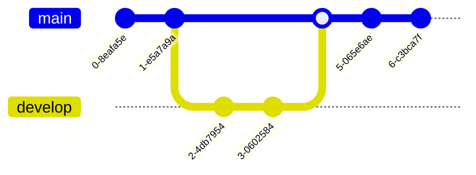

# Test Mermaid Charts

This file contains various types of Mermaid diagrams for testing purposes.

## Flowchart Example

## Sequence Diagram Example

## State Diagram Example

## Mind Map Example

## Git Graph Example

## ER Diagram Example

## Gantt Chart Example

## Pie Chart Example

